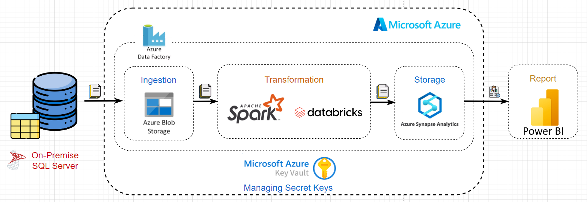

  

  

    <ul>
      
<h1 style="display: inline-block;">📊Analyzing Sales of AdventureWorks 2022</h1>

    </ul>
  

  
  
On-prem DB to Azure Cloud Pipeline with Data Factory, Data Lake Storage, Spark, Databricks, Synapse Analytics, PowerBI.

 

## 📑 Table of Contents
1. [Project Overview](#introduction)
2. [Key Insights](#key-insights)
3. [Project Architecture](#project-architecture)  
  3.1. [Data Ingestion](#data-ingestion)  
  3.2. [Data Transformation](#data-transformation)  
  3.3. [Data Loading](#data-loading)  
  3.4. [Data Reporting](#data-reporting)
4. [Reference](#reference)
5. [Contact](#contact)

## 🔬 Project Overview 

This an end-to-end data engineering project on the Azure cloud:
- Data ingestion from a on-premise SQL Server to Azure Data Lake Gen 2 using Data Factory.
- Data transformation using Databricks and Spark.
- Using Synapse Analytics to load data and store into Database.
- Reporting using PowerBI. 
- Using Azure Key Vault for the secret key storing.

### 🗃️ Dataset

**AdventureWorks** is a database provided by Microsoft for free on online platforms. It is a product sample database originally published by Microsoft to demonstrate the supposed design of a SQL server database. Here are some key points to know about AdventureWorks:

- AdventureWorks database supports a manufacturing MNC named Adventure Works Cycles.
- It is a sample Online Transaction Processing (or OLTP) database, which is a type of data processing where multiple transactions occur concurrently. These are shipped by Microsoft with all of their SQL server products.

> For this project I used the **Lightweight(LT) AdventureWorksLT2022 data**: a lightweight and pared down version of the OLTP sample.
<a href="https://learn.microsoft.com/en-us/sql/samples/adventureworks-install-configure?view=sql-server-ver16&tabs=ssms" target="_blank">AdventureWorks sample databases</a>

### 🎯 Project Goals

- Establish a connection between on-premise SQL server and Azure cloud.
- Ingest tables into the Azure Data Lake.
- Apply data cleaning and transformation using Azure Databricks.
- Utilize Azure Synapse Analytics for loading clean data and storage into database.
- Create interactive data visualizations and reports with Microsoft Power BI.
- Implement Azure Key Vault for monitoring and governance.

## 💡 Key Insights

- 🛒 **Number of products sold by Product Category**
  - *Touring Bikes* is the top number 1 of products sold with 252(12.07%) followed by *Jerseys* with 230(11.02%), *Road Bikes* with 222(10.64%) and *Mountain Bikes* with 209(10.01%).
 
- 💸 **Total revenue and quantity of products ordered by customer ID and name**
  - **Top 1:** Terry(ID:29736) have the most total sales with $119960.82 of total revenue and 267 quantity of products ordered.
  - **Top 2:** Krishna(ID:30050) have the second total sales with $108597.95 of total revenue and 197 quantity of products ordered.
  - **Top 3:** Christopher(ID:29546) have the third total sales with $98138.21 of total revenue and 167 quantity of products ordered.

- 📋 **List of sales quantity information of each product** 

## 🛠️ Project Architecture

You can find the detailed information on the diagram below:

### 📤 Data Ingestion
- Connected the on-premise SQL Server with Azure using Microsoft Integration Runtime.

- Setup the **Resource group** with needed services (Key Vault, Storage Account, Data Factory, Databricks, Synapse Analytics)

- Migrated the tables from on-premise SQL Server to Azure Data Lake Storage Gen2.

- Data Pineline using Azure Data Factory to loading data from On-permise SQL Server to Data Lake Gen 2, transfomed data and save cleared data.

### ⚙️ Data Transformation
- Mounted Azure Blob Storage to Databricks to retrieve raw data from the Data Lake.
- Used Spark Cluster in Azure Databricks to clean and refine the raw data.
- Saved the cleaned data in a Delta format; optimized for further analysis.

### 📥 Data Loading
- Used Azure Synapse Analytics to load the refined data efficiently.
- Created SQL database and connected it to the data lake.

### 📊 Data Reporting
- Connected Microsoft Power BI to Azure Synapse, and used the Views of the DB to create interactive and insightful data visualizations.

### 🛠️ Technologies Used

- **Data Source**: SQL Server
- **Orchestration**: Azure Data Factory
- **Ingestion**: Azure Data Lake Gen2
- **Storage**: Azure Synapse Analytics
- **Authentication and Secrets Management**: Azure Key Vault
- **Data Visualization**: PowerBI

## 📋 Reference

- This Project is inspired by the video of the [YouTube Channel "Mr. K Talks Tech"](https://www.youtube.com/watch?v=iQ41WqhHglk)  

## 📨 Contact Me

- Name: Nguyễn Quang Phúc
- Gmail: nguyenquangphuc412@gmail.com